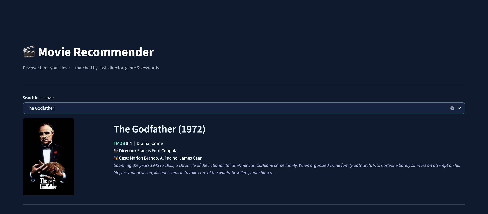

# 🎬 Movie Recommendation System

[](https://samadzaheer-movie-recommender.streamlit.app)

A content-based movie recommender app built with Streamlit. Pick any movie from the TMDB 5000 dataset and instantly get 10 similar recommendations — matched by cast, director, genres, and keywords. The app pulls live poster images and ratings from the TMDB API and displays results in a clean, dark-themed UI.

---

## Screenshot




---

## Tech Stack

- **Python** — core language
- **Streamlit** — web app framework
- **scikit-learn** — CountVectorizer + cosine similarity
- **pandas / numpy** — data processing and matrix operations
- **TMDB API** — live poster images and movie metadata

---

## How It Works

- **Metadata soup** — for each movie, cast (top 3), director, genres, and keywords are combined into a single text string after lowercasing and removing spaces to prevent tokenization errors.
- **CountVectorizer** — converts every movie's soup into a numerical word-count vector, building a shared vocabulary across all 4,803 movies.
- **Cosine similarity** — measures the angle between any two movie vectors; a score close to 1 means the movies share similar attributes, close to 0 means they don't.
- **Precomputed matrix** — the full 4,803 × 4,803 similarity matrix is computed once by `precompute.py` and saved to disk, so the app can return recommendations instantly without any runtime computation.

---

## Dataset

- `tmdb_5000_movies.csv` — movie metadata (title, genres, keywords, overview, vote average, vote count)
- `tmdb_5000_credits.csv` — cast and crew information per movie
- Source: [TMDB 5000 Movie Dataset](https://www.kaggle.com/datasets/tmdb/tmdb-movie-metadata) on Kaggle
- Size: 4,803 movies after merging the two files

---

## Run Locally

```bash
# 1. Clone the repo
git clone https://github.com/SamadZaheer/movie-recommender.git
cd movie-recommender

# 2. Install dependencies
pip install -r requirements.txt

# 3. Add your TMDB API key
# Create .streamlit/secrets.toml and add:
# TMDB_API_KEY = "your-api-key-here"

# 4. Precompute the similarity matrix (run once)
python precompute.py

# 5. Launch the app
streamlit run app.py
```

> **Note:** `precompute.py` requires the raw CSV files (`tmdb_5000_movies.csv` and `tmdb_5000_credits.csv`) in a folder called `Movie Recommendation System copy/`. These are not included in the repo due to size. Download them from [Kaggle](https://www.kaggle.com/datasets/tmdb/tmdb-movie-metadata).
